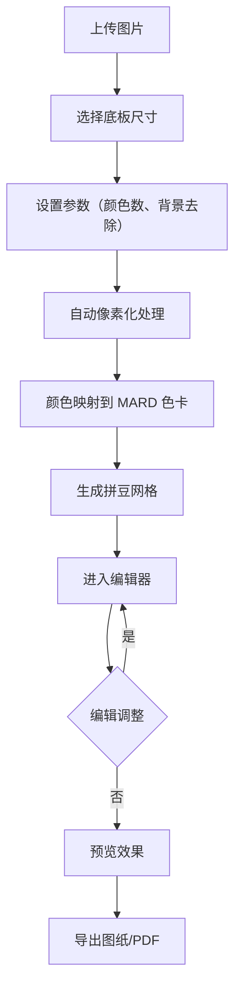
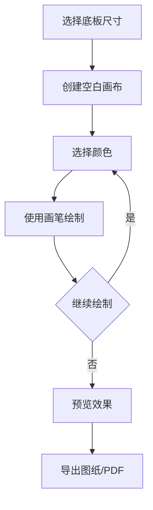

## 1. Product Overview
拼豆图纸生成器是一款在线工具，帮助用户将任意图片转换为可打印的拼豆网格图纸，并提供在线拼豆功能。采用 MARD 221 标准版色卡（221色），支持多种底板尺寸，自动完成颜色映射和像素化处理。
- 目标用户：手工爱好者、拼豆玩家、设计师
- 核心价值：快速将图片转为拼豆图纸，在线创作拼豆作品，节省设计时间，提升创作效率

## 2. Core Features

### 2.1 User Roles
| Role | Registration Method | Core Permissions |
|------|---------------------|------------------|
| Normal User | 无需注册 | 上传图片、生成图纸、在线拼豆、下载输出 |

### 2.2 Feature Module
1. **首页（入口选择）**：两个入口按钮，图纸生成器和线上拼豆
2. **图纸生成器**：图片上传、自动像素化、颜色映射、编辑器
3. **线上拼豆**：空白画布、画笔工具、颜色选择、对称模式
4. **导出页**：图纸下载、颜色统计、打印预览

### 2.3 Page Details
| Page Name | Module Name | Feature description |
|-----------|-------------|---------------------|
| 首页 | 入口选择 | 两个大按钮：图纸生成器、线上拼豆 |
| 首页 | 尺寸选择 | 52×52、78×78、104×104 三种标准尺寸 |
| 首页 | 色卡预览 | MARD 221 色卡展示，支持搜索和筛选 |
| 图纸生成器 | 图片上传 | 支持拖拽上传，支持常见图片格式 |
| 图纸生成器 | 参数设置 | 颜色限制数量、背景去除、抖动算法开关 |
| 图纸生成器 | 像素网格 | 实时显示转换后的拼豆网格 |
| 线上拼豆 | 空白画布 | 创建指定尺寸的空白网格 |
| 线上拼豆 | 画笔工具 | 画笔、橡皮擦、填充、吸管、对称模式 |
| 线上拼豆 | 颜色选择 | 从 MARD 色卡中选择颜色进行绘制 |
| 编辑器 | 颜色替换 | 全局颜色替换、局部颜色修改 |
| 编辑器 | 实时预览 | 显示原图与拼豆效果对比 |
| 编辑器 | 缩放漫游 | 滚轮缩放、拖拽平移 |
| 导出页 | 图纸下载 | 导出 PNG 或 PDF 格式的网格图纸 |
| 导出页 | 颜色统计 | 统计每种颜色所需豆子数量 |
| 导出页 | 打印预览 | 优化打印布局，方便直接打印 |

## 3. Core Process

### 3.1 图纸生成器流程

### 3.2 线上拼豆流程

## 4. User Interface Design

### 4.1 Design Style
- Primary color: #4A90D9 (蓝色系，清爽现代)
- Secondary colors: #FF6B6B (点缀色)
- Button style: 圆角矩形，渐变背景
- Font: 圆润可爱的字体，适合手工主题
- Layout style: 卡片式布局，清晰的视觉层次
- Icon style: 简洁的线性图标

### 4.2 Page Design Overview
| Page Name | Module Name | UI Elements |
|-----------|-------------|-------------|
| 首页 | Hero section | 大标题、两个入口按钮、尺寸选择器 |
| 首页 | Color palette | MARD 221 色卡展示，按色系分组 |
| 图纸生成器 | Upload area | 拖拽上传区域，支持点击选择 |
| 图纸生成器 | Settings panel | 参数设置：尺寸、颜色数、背景去除 |
| 线上拼豆 | Canvas | 空白网格画布，支持缩放和拖拽 |
| 线上拼豆 | Toolbar | 画笔、橡皮擦、填充、吸管、对称模式开关 |
| 编辑器 | Grid canvas | 像素网格，支持缩放和拖拽 |
| 编辑器 | Color palette | MARD 221 色卡，支持搜索筛选 |
| 导出页 | Stats panel | 颜色统计表格，豆子数量清单 |
| 导出页 | Preview | 打印预览区域，导出按钮 |

### 4.3 Responsiveness
- Desktop-first design
- Mobile adaptive: 简化布局，触控优化
- Touch optimization: 支持手势缩放和拖拽

## 5. Color Standards
采用 MARD 221 标准版拼豆色卡（221色）：
- A系（黄橙系）：26色 (A1-A26)
- B系（绿色系）：32色 (B1-B32)
- C系（蓝青系）：29色 (C1-C29)
- D系（蓝紫系）：26色 (D1-D26)
- E系（粉玫系）：24色 (E1-E24)
- F系（红色系）：25色 (F1-F25)
- G系（棕肤系）：21色 (G1-G21)
- H系（黑白系）：23色 (H1-H23)
- M系（大地系）：15色 (M1-M15)

## 6. Size Standards
支持三种标准底板尺寸：
- 小号：52×52 格
- 中号：78×78 格
- 大号：104×104 格

## 7. Core Algorithms

### 7.1 颜色匹配算法
- 使用 CIE-Lab/CIEDE2000 色差算法进行颜色匹配
- 避免简单 RGB 欧几里得距离导致的视觉色差问题
- 支持加权感知距离，更符合人眼视觉感知

### 7.2 像素化算法
- 使用主导色（Mode）采样而非 RGB 平均
- 避免"黑边"问题
- 支持 Floyd-Steinberg 抖动算法选项

### 7.3 背景去除
- 使用洪水填充算法自动识别边缘背景
- 可设置背景色容差阈值

### 7.4 对称模式
- 支持水平对称、垂直对称、中心对称
- 绘制时自动镜像到对称位置
