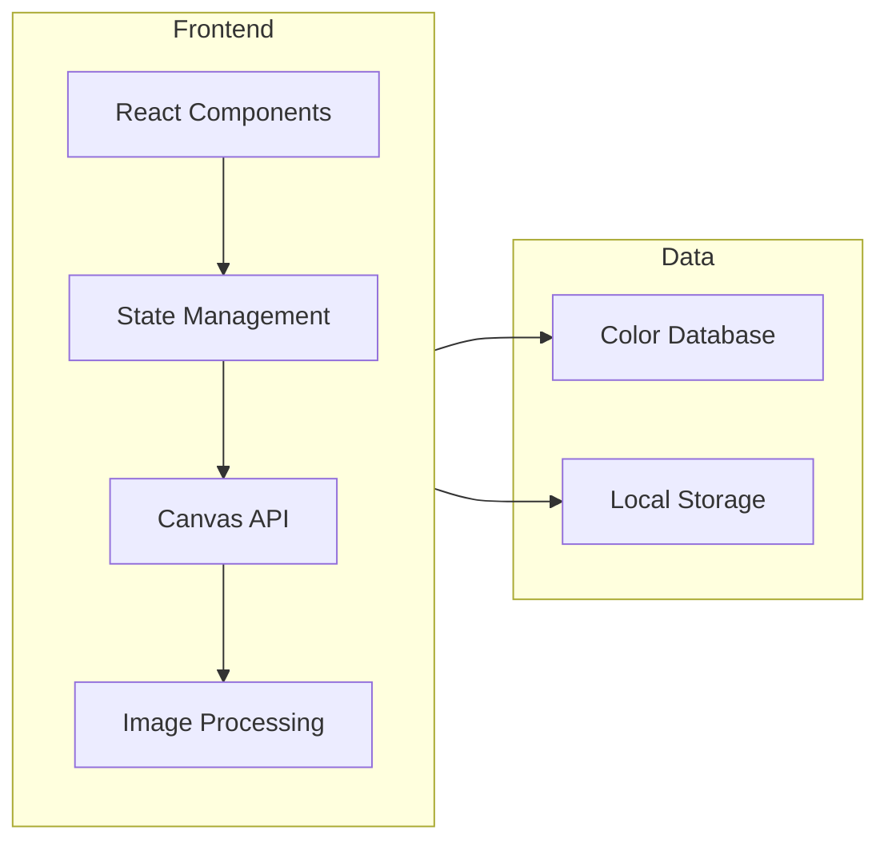

## 1. Architecture Design


## 2. Technology Description
- Frontend: React@18 + TypeScript + TailwindCSS@3 + Vite
- Initialization Tool: vite-init
- Backend: None (纯前端应用)
- Image Processing: HTML5 Canvas API
- State Management: Zustand

## 3. Route Definitions
| Route | Purpose |
|-------|---------|
| / | 首页，入口选择和尺寸设置 |
| /generator | 图纸生成器，图片上传和转换 |
| /editor | 编辑器页面，网格编辑 |
| /online | 线上拼豆，空白画布绘制 |
| /export | 导出页面，预览和下载 |

## 4. Data Model

### 4.1 Color Data Structure
```typescript
interface Color {
  id: string;           // 色号，如 A1, B2
  name: string;         // 颜色名称（中文）
  category: string;     // 色系，如 A, B, C
  hex: string;          // HEX 值
  rgb: { r: number; g: number; b: number };  // RGB 值
  lab: { l: number; a: number; b: number };  // CIE-Lab 值
}
```

### 4.2 Project Data Structure
```typescript
interface Project {
  id: string;
  name: string;
  size: number;         // 52, 78, 104
  grid: string[][];     // 颜色 ID 二维数组
  originalImage?: string; // 原始图片 Base64（仅图纸生成器）
  mode: 'generator' | 'online'; // 模式类型
  createdAt: Date;
}
```

### 4.3 MARD 221 Color Database
包含 221 种颜色的完整数据，按色系分组：
- A系（黄橙系）：A1-A26
- B系（绿色系）：B1-B32
- C系（蓝青系）：C1-C29
- D系（蓝紫系）：D1-D26
- E系（粉玫系）：E1-E24
- F系（红色系）：F1-F25
- G系（棕肤系）：G1-G21
- H系（黑白系）：H1-H23
- M系（大地系）：M1-M15

**数据来源**：pd.anqstar.com/colors 和 doudougongfang.com

## 5. Core Algorithms

### 5.1 CIE-Lab/CIEDE2000 颜色匹配
1. 将 RGB 颜色转换为 CIE-Lab 色彩空间
2. 使用 CIEDE2000 色差公式计算距离
3. 选择距离最小的颜色作为匹配结果
4. 公式：ΔE00 = √[(ΔL'/kL)² + (Δa'/kC)² + (Δb'/kH)² + RT(Δa'Δb')]

### 5.2 Image Pixelation（主导色采样）
1. 将图片缩放到目标尺寸（如 52×52）
2. 对每个网格区域统计颜色频率
3. 使用出现频率最高的颜色（Mode）而非平均值
4. 避免"黑边"问题

### 5.3 Floyd-Steinberg Dithering（可选）
1. 计算当前像素与匹配颜色的误差
2. 将误差扩散到相邻像素
3. 产生更平滑的颜色过渡效果

### 5.4 Background Removal
1. 使用洪水填充算法从图像边缘开始
2. 识别背景颜色并标记
3. 背景像素不参与颜色统计

### 5.5 Symmetry Mode
1. 支持水平对称、垂直对称、中心对称
2. 绘制时自动计算对称位置
3. 同步更新对称位置的颜色

## 6. Project Structure
```
src/
├── components/          # UI 组件
│   ├── ColorPalette/    # 色卡组件
│   ├── GridCanvas/      # 网格画布
│   ├── Toolbar/         # 工具栏（画笔、橡皮擦等）
│   ├── UploadArea/      # 上传区域
│   └── StatsPanel/      # 颜色统计面板
├── data/                # 数据文件
│   └── colors.ts        # MARD 221 颜色数据（含 HEX、RGB、Lab）
├── hooks/               # 自定义 Hooks
│   ├── useColorMatch.ts # CIE-Lab 颜色匹配
│   ├── useImageProcess.ts # 图片处理（像素化、背景去除）
│   └── useProject.ts    # 项目状态管理
├── pages/               # 页面组件
│   ├── Home.tsx         # 首页（入口选择）
│   ├── Generator.tsx    # 图纸生成器
│   ├── Online.tsx       # 线上拼豆
│   ├── Editor.tsx       # 编辑器
│   └── Export.tsx       # 导出页
├── stores/              # Zustand stores
│   └── projectStore.ts  # 项目状态
├── utils/               # 工具函数
│   ├── colorUtils.ts    # 颜色工具（RGB转Lab、CIEDE2000）
│   ├── imageUtils.ts    # 图片工具（像素化、抖动）
│   └── exportUtils.ts   # 导出工具（PNG、PDF）
└── App.tsx              # 主应用
```

## 7. External Dependencies
- react-router-dom: 路由管理
- zustand: 状态管理
- tailwindcss: 样式框架
- lucide-react: 图标库

## 8. Key Features Implementation

### 8.1 图纸生成器
- 图片上传：使用 FileReader API
- 像素化：Canvas drawImage 缩放 + 主导色采样
- 颜色匹配：CIE-Lab 距离计算
- 参数调整：亮度、对比度、饱和度、颜色限制数量

### 8.2 线上拼豆
- 空白画布：初始化全白/全透明网格
- 画笔工具：鼠标/触摸事件处理
- 对称模式：计算对称坐标并同步绘制
- 填充工具：洪水填充算法

### 8.3 编辑器
- 缩放漫游：鼠标滚轮缩放、拖拽平移
- 颜色替换：全局替换、局部修改
- 撤销重做：历史记录栈

### 8.4 导出功能
- PNG 导出：Canvas toDataURL
- PDF 导出：使用 jsPDF 生成可打印文档
- 材料清单：统计每种颜色使用数量
